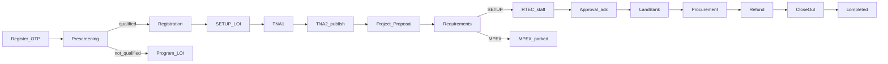

# aiSETUP Official Walkthrough Brief

**Audience:** High officials / DOST XII leadership  
**Purpose:** Defensible summary of case lifecycle, gates, and data integrity  
**Presentation narrative:** Register **one new client** and process that case start to end  
**Date of audit / rehearsal prep:** 2026-08-05  
**Companion docs:** [LIVE_DEMO_SCRIPT.md](./LIVE_DEMO_SCRIPT.md) · [E2E_REHEARSAL_LOG.md](./E2E_REHEARSAL_LOG.md) · [WORKFLOW_DIAGRAMS.md](./WORKFLOW_DIAGRAMS.md) · [STAKEHOLDER_SLIDES.md](./STAKEHOLDER_SLIDES.md)

---

## Verdict

The SETUP pipeline from **registration through project close-out** is consistent with the canonical module order, enforced by frontend locks and backend gates, and covered by automated regression. Alternate tracks (program LOI, MPEX) are capped so they cannot silently enter the seed-fund path. Official documents stay hidden from clients until staff **publish**; published flags cannot be demoted.

**How you will show it:** Do not hop across seed accounts. Register a fresh applicant, write down the `LOI-YYYY-######`, and walk staff + applicant gates on that same case through **Completed**. Full click-path: [LIVE_DEMO_SCRIPT.md](./LIVE_DEMO_SCRIPT.md). Rehearsal results: [E2E_REHEARSAL_LOG.md](./E2E_REHEARSAL_LOG.md).

---

## Canonical pipeline

Source of truth: `shared/module-order.json`

| # | Module | Who acts |
|---|--------|----------|
| 1 | Pre-Screening | Applicant |
| 2 | Enterprise Registration | Applicant (qualified only) |
| 3 | Letter of Intent | Applicant (SETUP or program LOI) |
| 4–5 | TNA 1 → TNA 2 | Applicant submit; staff review / publish |
| 6 | Project Proposal (Form 001) | Applicant |
| 7 | Submit Requirements | Applicant upload; staff approve & route |
| 8 | Conduct of RTEC | **Staff only** (client on dashboard) |
| 9 | Approval Letter | Staff publish → client conforme |
| 10–13 | LandBank → Procurement → Refund → Close-Out | Shared; staff unlocks MOA/PDCs/LBP intro |
| 14 | Completed | Terminal state |

---

## What each gate proves

| Transition | Proof |
|------------|--------|
| Prescreen → Registration | `qualified === true` (eligibility) |
| Unqualified → Program LOI | Recommended program selected; LOI omits seed-fund / refund terms |
| TNA2 → Proposal | Client sees technical report only when **published** |
| Requirements → RTEC | `staffDecision === "approved"` and SETUP route |
| Requirements → MPEX | Client locked to requirements/dashboard; no RTEC/funding modules |
| Approval → LandBank | Published notice + client conforme + staff-uploaded signed MOA + PDCs; LBP intro published before LandBank submit |
| Close-Out → Completed | Terminal report, audited FS, equipment ack, inventory row(s), ownership cert |

**Staff assessment checklist** (Clients hub) is a collapsed “needs review” view — it does **not** renumber the applicant MODULE_ORDER. Prefer the pipeline table above when briefing officials.

---

## Integrity guarantees (say this confidently)

1. **Server-side auth** — JWT Bearer on `/api/**`; FE does not invent login.
2. **One-step advance** — Applicants cannot skip modules via API (staff may advance freely).
3. **Branch caps (FE + BE)** — Program referral stops at LOI; MPEX cannot enter SETUP funding modules.
4. **Publish visibility** — Unpublished staff docs never returned to applicants; no unpublish API.
5. **Typed islands** — Known `moduleData` keys must be objects with boolean `published` / `submitted` where required; hard submit/publish validates business fields.
6. **LandBank MOA** — Server checks staff file upload (`signedMoa`), not client-writable flags alone.

---

## Automated verification (2026-08-05)

| Suite | Result |
|-------|--------|
| FE `systemFlow.test.ts` (SETUP → completed, program LOI, MPEX, demo warnings) | Pass |
| FE integrity (`normalizeHydrate`, `approvalLetterPublish`, `syncRouting`, `sharedContracts`) | Pass |
| BE integrity / gates / content / persistence / security hardening | Pass (35+ targeted tests; gate/content re-run after fixes) |

**Live presentation dry-run:** Rehearse on **local/staging** by registering a new client and finishing that case ([LIVE_DEMO_SCRIPT.md](./LIVE_DEMO_SCRIPT.md)). Seed accounts are a **time-fallback appendix** only. Do **not** create OTP/demo cases on production for rehearsal.

---

## Audit fixes applied (this pass)

| Issue | Fix |
|-------|-----|
| Program / MPEX caps were FE-only | BE `WorkflowGateService` enforces same caps; allows program jump `prescreening` → `letter-of-intent` |
| Header sync before `caseMeta` could race branch flags | FE syncs module rows / `caseMeta` **before** `currentModule` header advance |
| Close-out inventory required on FE only | BE hard-transition now requires an inventory description row |
| Stakeholder diagrams/scripts put requirements **before** proposal | Presentation docs aligned to `MODULE_ORDER` |

---

## Documented (not blocking)

- Legacy PIS module aliases still normalize into LandBank.
- Whole-blob dual-write remains best-effort; staff-owned keys stay protected on merge.
- Soft BE RTEC gate for approval+ (`past RTEC` **or** published report) is slightly broader than FE staff RTEC submit prerequisites — both still require staff action before clients proceed.

---

## Recommended live path (register → close-out)

1. **Register** new client (OTP) → note `LOI-…` on dashboard; show locked future modules.  
2. Qualify → enterprise registration → **SETUP LOI** (seed-fund / refund language).  
3. TNA1 submit → staff review → **TNA2 publish** (applicant sees publish gate).  
4. Project proposal → requirements → staff **Approve + SETUP** → RTEC (client waits) → approval publish → conforme.  
5. Staff MOA + PDCs + LBP intro → LandBank → procurement → refund → close-out → **Completed**.

**If time is cut:** Appendix A in [LIVE_DEMO_SCRIPT.md](./LIVE_DEMO_SCRIPT.md) (seed TNA2 publish demo) — still say the full path starts with a live registration.
