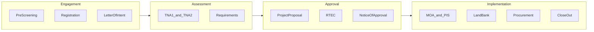
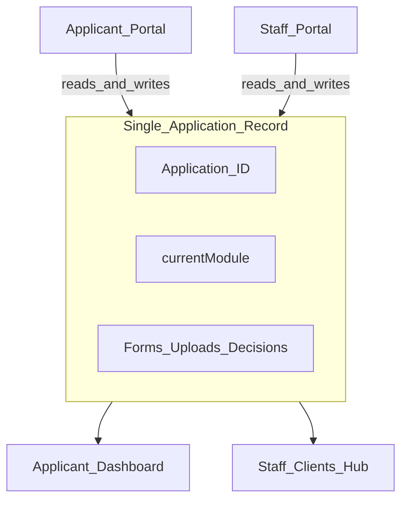

# aiSETUP Stakeholder Presentation — Slide Deck

Copy each slide block into PowerPoint, Google Slides, or Canva. Speaker notes appear after `---` under each slide.

**Suggested timing:** 20–25 minutes (slides) + 15–20 minutes (live demo)

---

## Slide 1 — Title

**aiSETUP**

*Digital workflow for the DOST SETUP Program*

Department of Science and Technology — Region XII

---

**Speaker notes:** Open with the program name. aiSETUP is the working title for a digital platform that carries an enterprise from first interest in SETUP through project close-out on one shared case record.

**Screenshot:** Login page with DOST branding and dual portals (Applicant / Staff).

---

## Slide 2 — Why aiSETUP

**The challenge today**

- SETUP applications span many official forms, annexes, and handoffs across provincial offices
- Paper and email make status hard to track for both enterprises and DOST staff
- Review cycles depend on staff publishing official documents before the client can proceed

**What aiSETUP delivers**

- One digital case from pre-screening through terminal report
- Clear roles: enterprise prepares; DOST reviews and publishes
- AI-assisted drafting for key documents (LOI, TNA, Project Proposal)
- Provincial visibility for agents; regional oversight for administrators

---

**Speaker notes:** Frame this as operational improvement, not IT for its own sake. The goal is faster, more transparent SETUP processing with an audit trail.

**Screenshot:** Applicant dashboard showing progress stepper and application ID (e.g. `LOI-2024-000145`).

---

## Slide 3 — Who Uses the System

| Role | Who | What they see |
|------|-----|---------------|
| **Applicant** | MSME owner or representative | Own application only — forms, uploads, acknowledgments |
| **DOST Agent** | Provincial SETUP focal | Clients in assigned province(s); review and publish workflows |
| **DOST Admin** | Regional coordinator | All regional clients; same tools as agents with broader scope |

- One application shell; access controlled by role
- Staff select which client case they are working on
- Applicants log in with credentials set during enterprise registration

---

**Speaker notes:** Emphasize that staff never “lose” a case — they pick it from a provincial registry. Applicants never see internal steps like RTEC.

**Screenshot:** Staff client picker bar (`StaffClientBar`) with enterprise name and application ID.

---

## Slide 4 — The Journey in Four Phases

1. **Engagement** — Qualify, register, submit Letter of Intent  
2. **Assessment** — Technology Needs Assessment (TNA) and documentary requirements  
3. **Approval** — Project proposal, RTEC evaluation, Notice of Approval  
4. **Implementation** — MOA signing, fund release, procurement, refund monitoring, close-out

---

**Speaker notes:** This is the “one slide” overview. Stakeholders should leave remembering four phases, not fourteen modules.

**Screenshot:** Dashboard progress list with phase groupings highlighted.

---

## Slide 5 — What the Applicant Does

**Applicant responsibilities across the pipeline**

| Phase | Applicant action |
|-------|------------------|
| Engagement | Complete pre-screening, register enterprise, draft and submit LOI |
| Assessment | Fill **DOST TNA Form 01**, review published TNA technical report, upload required documents |
| Approval | Complete **SETUP Form 001** (Project Proposal); acknowledge Notice of Approval (conforme) |
| Implementation | Attend MOA signing; open LandBank account; submit procurement and liquidation docs; file terminal report |

- Cannot skip ahead — future steps stay locked until DOST unlocks them
- Sees **“Under DOST Review”** when staff are processing internal steps
- Receives in-app notifications when decisions are made

---

**Speaker notes:** The applicant is always the data owner for their enterprise profile and uploads. Official DOST documents appear only after staff publish them.

**Screenshot:** Applicant sidebar with locked (grayed) future modules and current step highlighted.

---

## Slide 6 — What DOST Staff Do

**Staff responsibilities across the pipeline**

| Phase | Staff action |
|-------|--------------|
| Assessment | Review TNA Form 01; generate, edit, and **publish** TNA Form 02 technical report; verify requirements and route to SETUP or MPEX |
| Approval | Conduct **RTEC** (staff-only); prepare and **publish** Notice of Approval (SETUP Form 003 · Annex A-3) |
| Implementation | Manage MOA signing day; publish LandBank introduction letter; verify procurement; monitor refund schedule and delinquency |

- **Clients hub** shows which cases need review (`Needs review` badges)
- Provincial agents see only their province’s enterprises
- Every publish or approval action unlocks the next client step

---

**Speaker notes:** Staff are the gatekeepers for official documents. The system makes their queue visible instead of buried in email.

**Screenshot:** Clients hub (`ClientManagement`) with assessment task statuses.

---

## Slide 7 — One Shared Case (Staff–Client Relationship)

**Core idea:** Applicant and DOST staff work on the **same case**.

- Application ID (e.g. `LOI-2024-000145`) ties everything together
- `currentModule` shows where the case sits in the pipeline
- Staff switch between clients; applicant sees only their own record
- Case data can be persisted to the server for continuity

---

**Speaker notes:** This is the relationship slide. Neither side has a separate spreadsheet — one source of truth, two views.

**Screenshot:** Same enterprise (`ABC Food Processing`) shown in applicant dashboard and staff client detail side by side.

---

## Slide 8 — The Handoff Pattern

**Repeatable cycle:** *Client submits → Staff reviews or publishes → Client proceeds*

| Step | Client | Staff | Gate |
|------|--------|-------|------|
| TNA 1 | Submits DOST TNA Form 01 | Approves or requests resubmission | Staff review |
| TNA 2 | Read-only until published | Generates and **publishes** technical report | `published` flag |
| Requirements | Uploads documents | Verifies each doc; approves or requests revision; routes SETUP vs MPEX | Staff decision |
| Project Proposal | Submits SETUP Form 001 | Conducts RTEC (invisible to client) | Staff-only RTEC |
| Approval | Acknowledges conforme | **Publishes** Notice of Approval | `published` + conforme |
| MOA / PIS | Waits for signing day | Uploads signed MOA; marks signing complete | `signingDayComplete` |
| LandBank | Opens account; uploads passbook | **Publishes** LBP introduction letter | LBP intro published |

---

**Speaker notes:** Walk through one row slowly — TNA2 is the clearest example: client cannot see the report until staff publish it.

**Screenshot:** TNA 2 module showing “Publish” button on staff view vs read-only banner on applicant view.

---

## Slide 9 — Visibility and Accountability

**For applicants**

- Dashboard stepper: completed / current / upcoming steps
- Status labels: In Progress, Under DOST Review, Revisions Needed, MPEX Track, Completed
- Notification bell for decisions (requirements approved, TNA2 published, approval letter ready, etc.)

**For staff**

- Clients hub with assessment tasks per stage (prescreening, TNA1, TNA2, requirements, post-proposal, LandBank, procurement, refund, close-out)
- In-app alerts scoped to provincial office
- Clicking a notification opens the relevant module for the selected client

**Result:** No ambiguity about who must act next.

---

**Speaker notes:** Accountability is built into the UI — not a separate tracking spreadsheet.

**Screenshot:** Notification bell dropdown on both applicant and staff sessions.

---

## Slide 10 — AI-Assisted Document Generation

**AI supports drafting — staff retain control**

| Document | Official reference | Who triggers |
|----------|-------------------|--------------|
| Letter of Intent | Program LOI template | Applicant (with AI suggestions) |
| TNA Form 01 | DOST TNA Form 01 | Applicant |
| TNA Form 02 Technical Report | DOST TNA Form 02 | Staff |
| Project Proposal | SETUP Form 001 | Applicant |

- AI generates structured drafts from enterprise data already in the case
- Staff review, edit, and publish before anything becomes official
- Reduces repetitive encoding; does not replace DOST judgment

---

**Speaker notes:** Position AI as a drafting assistant aligned to official form structures, not autonomous approval.

**Screenshot:** TNA 1 or Project Proposal with “Generate with AI” action and preview panel.

---

## Slide 11 — MPEX Branch (Capacity Building)

**Not every enterprise proceeds straight to SETUP funding**

After documentary requirements, staff may route a case to **MPEX** (MSME Productivity and Export) instead of the project proposal track.

- Client remains on the requirements/dashboard view
- SETUP approval pipeline pauses while capacity-building programs apply
- Routing is a explicit staff decision recorded on the case

**When to mention:** Use only if audience asks about non-SETUP pathways; one minute max.

---

**Speaker notes:** MPEX shows the system handles branch logic, not only a single happy path.

**Screenshot:** Requirements module staff routing panel (SETUP vs MPEX).

---

## Slide 12 — Post-Approval Fund Flow

**After Notice of Approval — implementation modules**

| Order | Module | Official form |
|-------|--------|---------------|
| 1 | Project Information Sheet / MOA signing day | SETUP Form 008 · Annex E (Pre-Implementation PIS) |
| 2 | LandBank account and fund withdrawal | LBP introduction letter (staff-published) |
| 3 | Procurement and liquidation | Receipt and equipment documentation |
| 4 | Refund and delinquent monitoring | Post-dated checks and repayment schedule |
| 5 | Project close-out | SETUP Form 010 (Terminal Report) |

Each step follows the same pattern: staff publish or verify → client submits → case advances.

---

**Speaker notes:** This is where SETUP meets fund release and compliance monitoring — often the highest-stakes phase for stakeholders.

**Screenshot:** LandBank & Withdrawal module showing introduction letter publish gate.

---

## Slide 13 — Live Demo Preview

**What we will show (15–20 minutes)**

1. Applicant dashboard — progress and locked steps  
2. TNA workflow — submit, staff review, publish  
3. Requirements — upload and staff verification  
4. RTEC and Approval Letter — staff-only then client conforme  
5. MOA signing and LandBank — fund release coordination  
6. Notifications — both sides stay informed  

**Live demo:** Use two browser windows (applicant + staff) and seed accounts at the appropriate workflow stage (see `LIVE_DEMO_SCRIPT.md`).

---

**Speaker notes:** Transition from slides to live app. Have agent and applicant logins ready in separate browser profiles or incognito windows.

**Screenshot:** Demo mode amber banner after unlock.

---

## Slide 14 — Q&A and Next Steps

**Discussion topics**

- Provincial rollout and agent training plan
- Integration with existing PSTO processes
- Data persistence and backup for production deployment
- Timeline for pilot vs regional launch

**Contact / project team**

- [Add presenter name and email]
- [Add DOST Region XII focal]

---

**Speaker notes:** Close with concrete next steps if known (pilot province, training date). Invite questions on workflow before technical architecture.

**Screenshot:** Completed dashboard or “Project Close-Out” terminal state.

---

## Appendix — Full Module List (reference slide, optional)

| # | Module | Primary actor |
|---|--------|---------------|
| 1 | Pre-Screening | Applicant |
| 2 | Enterprise Registration | Applicant |
| 3 | Letter of Intent | Applicant |
| 4 | TNA 1 Assessment | Applicant → Staff review |
| 5 | TNA 2 Technical Report | Staff publish → Applicant read |
| 6 | Submit Requirements | Applicant → Staff verify |
| 7 | Project Proposal (Form 001) | Applicant → Staff RTEC |
| 8 | Conduct of RTEC (Form 002) | Staff only |
| 9 | Approval Letter (Form 003) | Staff publish → Applicant conforme |
| 10 | Project Information Sheet | Staff MOA day → Applicant |
| 11 | LandBank & Withdrawal | Staff publish intro → Applicant |
| 12 | Procurement & Liquidation | Applicant → Staff verify |
| 13 | Refund & Delinquent | Staff monitor → Applicant PDCs |
| 14 | Project Close-Out (Form 010) | Applicant → Staff complete |

Use this slide only if audience wants detail beyond the four-phase overview.
