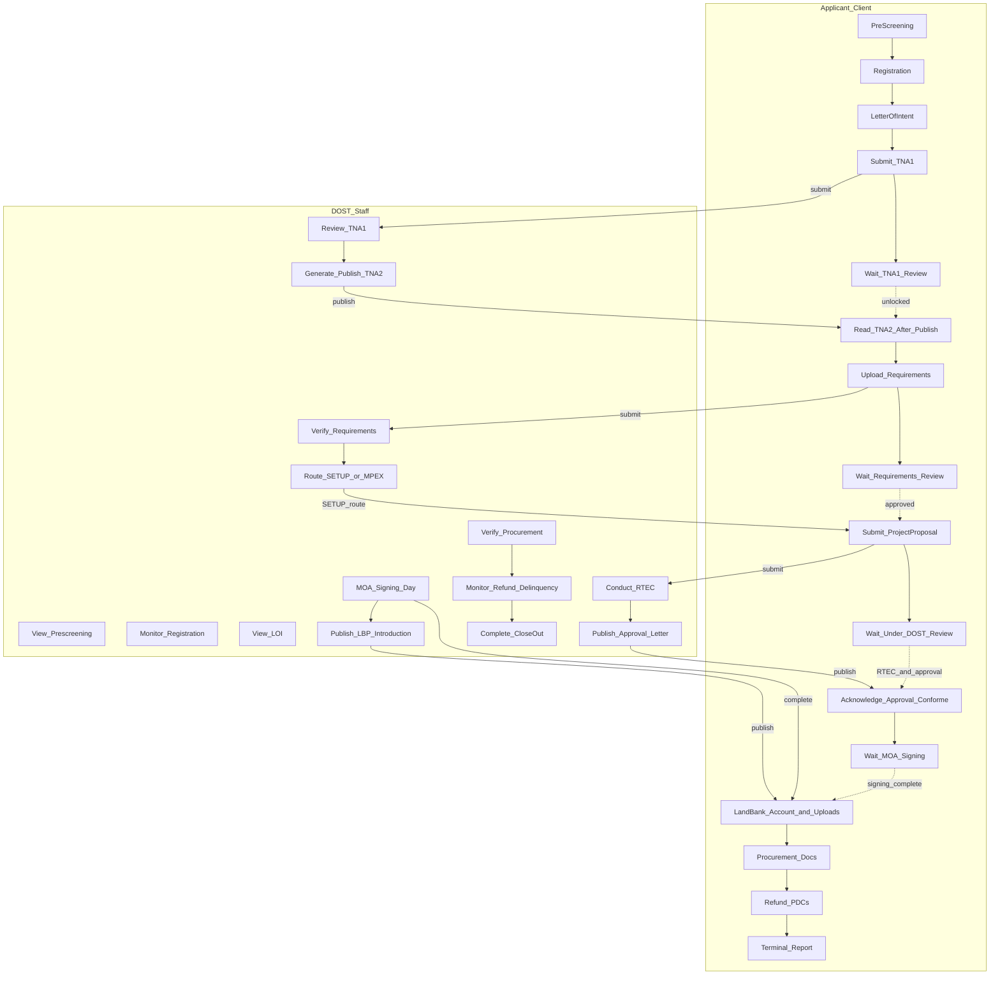
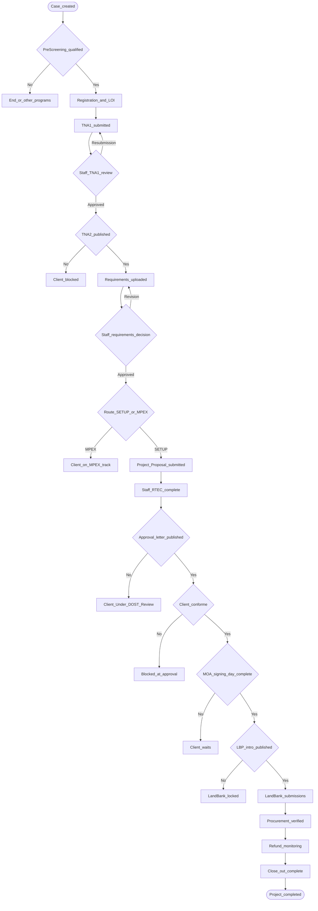
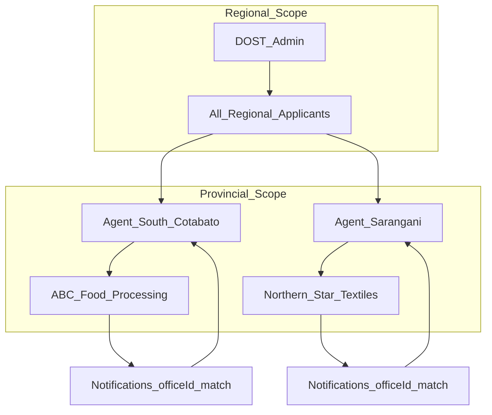
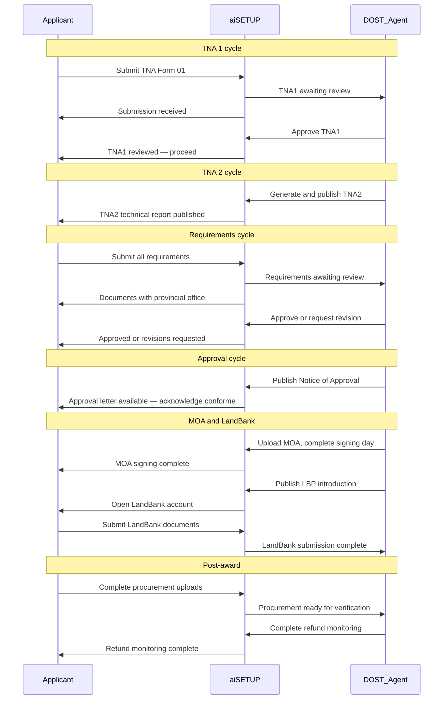

# aiSETUP Workflow Diagrams

Mermaid diagrams for stakeholder slides, documentation, or export to PNG/SVG via [Mermaid Live Editor](https://mermaid.live).

---

## 1. Swimlane — Client vs Staff (Full Pipeline)

Shows parallel responsibilities across all workflow modules. **Solid arrows** = primary action; **dashed** = wait state.

### Module-to-lane mapping

| Module | Client lane | Staff lane |
|--------|-------------|------------|
| Pre-Screening | Fill questionnaire | Optional monitoring |
| Registration | Complete profile | Review in Clients hub |
| Letter of Intent | Draft and submit | View case |
| TNA 1 | Submit Form 01 | Review / approve / resubmit |
| TNA 2 | Read after publish | Generate and publish Form 02 |
| Requirements | Upload docs | Verify, approve, route |
| Project Proposal | Submit Form 001 | — |
| Conduct of RTEC | *No access* | Form 002 evaluation |
| Approval Letter | Conforme after publish | Publish Form 003 |
| PIS / MOA | Wait, then ongoing filings | Signing day, uploads |
| LandBank | Account and withdrawal docs | Publish LBP intro |
| Procurement | Upload receipts | Verify, untagging |
| Refund | Submit PDCs | Monitor delinquency |
| Close-Out | Terminal report | Review and complete |

---

## 2. Handoff Gates — Decision Points

Each gate blocks the client until staff action (or client acknowledgment) completes.

### Gate summary table

| Gate | Blocking condition | Who releases |
|------|-------------------|--------------|
| TNA1 review | `tna1.submitted` without staff approval | DOST Agent |
| TNA2 publish | `tna2Document.published === false` | DOST Agent |
| Requirements | `staffDecision` pending | DOST Agent |
| SETUP vs MPEX | `routingDecision` not set | DOST Agent |
| RTEC | `currentModule === conduct-rtec` | DOST Agent (client sees “Under Review”) |
| Approval letter | `approvalLetter.published === false` | DOST Agent |
| Conforme | Client has not acknowledged | Applicant |
| MOA signing | `signingDayComplete === false` | DOST Agent |
| LBP introduction | `landBank.introductionLetter.published === false` | DOST Agent |
| Procurement | `staffReview.verified` pending | DOST Agent |

---

## 3. Provincial Scoping — Who Sees Which Clients

### Rules

| Role | Client visibility | Notifications |
|------|-------------------|---------------|
| **Applicant** | Own record only (`user.id` / email) | Applicant audience, own `applicantId` |
| **Agent** | Applicants in `assignedProvinces` | Staff audience, matching `officeId` |
| **Admin** | All applicants in region | Staff audience, all offices |

**Staff client picker:** Agent selects active client via `StaffClientBar` / Clients hub. All module actions apply to the selected case until switched.

**Demo seed enterprises (Region XII):**

| Enterprise | Province | Demo stage |
|------------|----------|------------|
| ABC Food Processing | South Cotabato | TNA 2 (unpublished report — good for publish demo) |
| Tech Innovations Inc. | General Santos City | Conduct of RTEC |
| Sunrise Agri-Products | Sultan Kudarat | Registration (early stage) |
| Northern Star Textiles | Sarangani | Requirements (awaiting staff review) |
| Green Valley Foods | South Cotabato | Approval letter (late stage) |

---

## 4. Notification Flow — Key Events

Sequence of in-app alerts between applicant and staff (no email required in demo).

### Notification catalog

| Event | Staff alert | Applicant alert |
|-------|-------------|-----------------|
| Pre-screening result | — | Passed / not qualified |
| TNA1 submitted | Awaiting review | Submission received |
| TNA1 reviewed | — | Proceed to next step |
| TNA1 resubmission | — | Revisions requested |
| TNA2 published | — | Report available |
| Requirements submitted | Awaiting review | With provincial office |
| Requirements approved | — | Proceed |
| Requirements revision | — | Flagged documents |
| Project proposal submitted | Awaiting RTEC | Under DOST review |
| Approval letter published | — | Acknowledge conforme |
| MOA uploaded | — | Signing materials ready |
| Signing day complete | — | LandBank unlocked |
| LBP intro published | — | Open account at LBP |
| LandBank complete | Review submission | — |
| Procurement complete | Verify docs | — |
| Refund monitoring complete | — | Monitoring closed |

---

## 5. Four-Phase Overview (compact)

Use on title or summary slides.

```mermaid
flowchart LR
  subgraph phase1 [Phase1_Engagement]
    PS[PreScreening]
    REG[Registration]
    LOI[LetterOfIntent]
  end
  subgraph phase2 [Phase2_Assessment]
    TNA1[TNA1_ClientSubmit]
    TNA2[TNA2_StaffPublish]
    REQ[Requirements_Upload]
    STAFF1[Staff_VerifyAndRoute]
  end
  subgraph phase3 [Phase3_Approval]
    PP[ProjectProposal]
    RTEC[RTEC_StaffOnly]
    AL[ApprovalLetter_Publish]
  end
  subgraph phase4 [Phase4_Implementation]
    MOA[MOA_SigningDay]
    LBP[LandBank_FundRelease]
    PROC[Procurement_Monitoring]
    CLOSE[ProjectCloseOut]
  end
  phase1 --> phase2 --> phase3 --> phase4
```

---

## Export tips

1. Paste any diagram into [mermaid.live](https://mermaid.live) and export PNG/SVG for slides.
2. For PowerPoint: use **Insert → Pictures** with exported PNG, or the Mermaid add-in if available.
3. Keep stakeholder slides to **one diagram per slide** — split swimlane if it feels crowded.
4. Use DOST brand colors manually after export if required by communications office.
